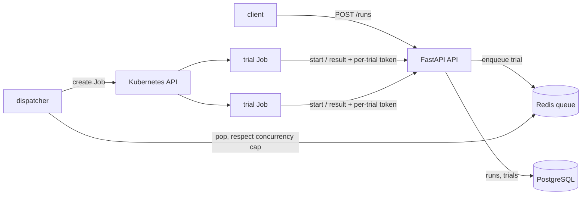

# Agent Eval Platform

Run LLM-agent benchmark trials as isolated Kubernetes Jobs and measure what matters for agents in production: **reliability (pass^k)** and **cost per resolved task**.

The target benchmark is Sierra's [τ³-Banking](https://taubench.com) (τ-bench knowledge domain), where the best frontier model reaches about 55% pass^1 and 35% pass^4. The platform is the measurement layer for a policy-compliant support-agent harness built on top of it.

> **Status: in progress.** The platform runs end to end on a local Kubernetes cluster with a deterministic `stub` agent. The τ-bench agent, observability stack, and EKS deployment are next (see Roadmap). No benchmark results are reported yet. Current status, known weaknesses and open questions: [docs/STATUS.md](docs/STATUS.md).

## Architecture



- **One trial = one Kubernetes Job**: its own pod, CPU/memory limits, non-root, read-only root filesystem, all capabilities dropped, and a deadline.
- **Least privilege**: trial pods get no database credentials and no Kubernetes API token. They call back to the API with a per-trial secret, compared in constant time. Only the dispatcher's service account may create Jobs, and only in its namespace.
- **Concurrency cap**: the dispatcher never runs more than `maxConcurrency` trials at once, which protects LLM rate limits and spend.
- **pass^k**: the probability an agent succeeds on *all* k attempts, estimated per task as C(c,k)/C(n,k) and averaged over tasks (see `app/metrics.py`).

## Run it locally

Requires Docker, [kind](https://kind.sigs.k8s.io), Helm, kubectl, and [uv](https://docs.astral.sh/uv/).

```bash
make test     # unit tests
make up       # kind cluster + image + Helm release
make smoke    # 5 tasks x k=2 = 10 trial Jobs, then prints the run summary
make down     # delete the cluster
```

## API

| Method | Path | Purpose |
|---|---|---|
| POST | `/runs` | Create a run (agent, domain, task_ids, k); enqueues task × k trials |
| GET | `/runs`, `/runs/{id}` | Status counts, pass^1..k, total cost |
| GET | `/runs/{id}/trials` | Per-trial results |
| POST | `/trials/{id}/start`, `/trials/{id}/result` | Trial pod check-in and result (requires `x-trial-token`) |

## Roadmap

- [x] API, Postgres schema, Redis queue, dispatcher, per-trial Kubernetes Jobs, Helm chart
- [ ] τ-bench agent in the trial pod (default agent baseline on τ³-Banking)
- [ ] OpenTelemetry traces (API → queue → pod, GenAI semantic conventions), Prometheus metrics, Grafana/Tempo/Loki
- [ ] Next.js dashboard: run comparison, pass^k curves, trajectory viewer
- [ ] Terraform for EKS + RDS + ElastiCache
- [ ] Harness: knowledge-base policy compiler, plan-then-verify, claim-verification gates
- [ ] Held-out evaluation with bootstrap CIs, ablations, leaderboard submission
