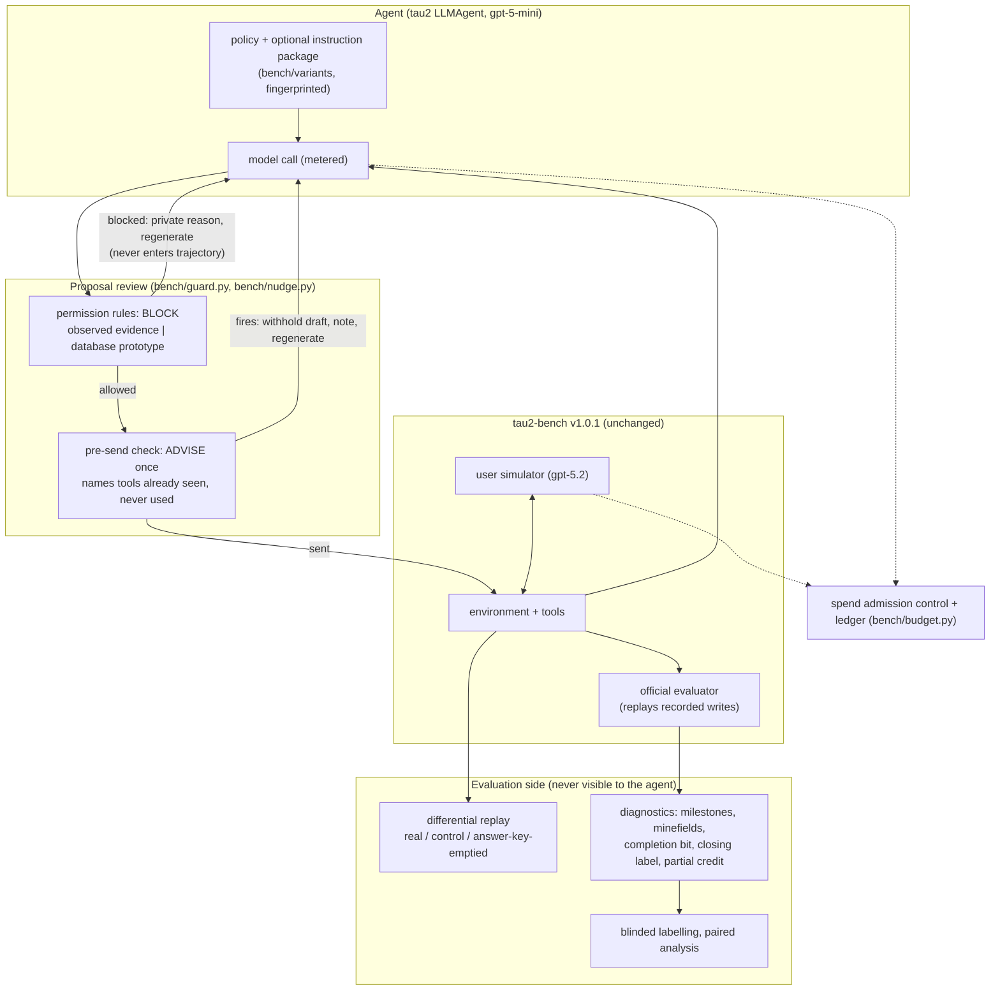

# Harness architecture: an evaluation and control layer around τ-Knowledge banking

Status: current as of 2026-09-27; describes implemented code (`bench/`), not plans. The Kubernetes platform (`app/`, `docs/ARCHITECTURE.md`) is a separate, frozen track; every result so far used this local harness.

## Design goals, in priority order

1. **Never change what is measured.** tau2's environment, tools, grader and user simulator stay unmodified; every harness change is opt-in, fingerprinted, and flagged in the trace. The official reward is always reported unchanged.
2. **Know what the agent could see.** Every component declares its information source; nothing reads the answer key except evaluation-side diagnostics, which are labelled as such.
3. **Spend only what was approved.** Admission control reserves a conservative upper bound per call and refuses what the allocation cannot cover.
4. **Everything reproducible from a commit.** Plans are committed before runs; traces, ledgers and labels are kept; zero-cost tests cover every mechanism.

## The layers

### Why review sits at the proposal step

tau2 grades a conversation by replaying every state-changing tool call recorded in it (`Environment.set_state`, strict: a mismatched replay raises). We intercept proposals **before they enter the benchmark trajectory**, so the unchanged evaluator receives only actions actually submitted. A blocked or withheld proposal is shown privately to the model and fully recorded in the research trace (`trace.guard.events`), and regenerations are metered as agent calls. Other designs could work with consistent replay instrumentation; this is the practical one here.

### Permission rules (block) vs pre-send checks (advise)

| | Permission rules (`bench/guard.py`) | Pre-send check (`bench/nudge.py`) |
|---|---|---|
| Purpose | Stop an action whose prerequisite is not met | Surface information the agent already has but ignored |
| Effect | Block, private reason, regenerate (≤3), then fixed refusal; a blocked call is never released | Withhold the draft once, add a note, regenerate |
| Evidence | Declared per rule: **observed** (the agent's own conversation + static tool types) or **environment_db** (prototype) | The agent's own conversation + static list of discoverable names |
| Rules / checks | `write_requires_logged_verification`, `verification_time_from_clock` (observed); `rewards_update_requires_approved_dispute` (database prototype) | `locked_named_tool_before_denial_or_transfer` |
| Scope | Checks only the named prerequisite; passing is not full authorization | Fires at most once per conversation |

**Why one rule is database-backed.** No agent tool can read `cash_back_disputes`: only the customer's submit tool writes it, and its result is routed to the customer. An observed-evidence version could never allow the legitimate flow (dev task_028). Runs using it must disclose the extra information channel.

**Why nudges must run with permission rules.** Offline replay over 19 live conversations: the pre-send check would fire in 13; its first-named tool is one the task needs in 7; in 3 it names only irrelevant tools, two of them the rewards write. Surfacing a write tool without an enforced prerequisite is a harm path.

### Evaluation side

| Component | What it answers | Source |
|---|---|---|
| Official reward | Did the task succeed (binary, unchanged) | tau2 evaluator |
| Differential replay (`bench/independence.py`, `bench/audit.py`) | Did anything the agent saw depend on the answer key | three fresh environments |
| Diagnostics (`bench/diagnostics.py`) | Why a run went as it did: minefields the observed rules would block, milestones, discoverable-tool use, completion bit, closing-message label, reference-action match (historical, evaluation-side) | observed / replay / reference / heuristic, kept separate |
| Continuations (`bench/continuation.py`) | What the agent does next at a known failure point, per instruction package | restored environment state, agent only |
| Blinded labelling (`bench/blind_export.py`) | Behaviour counts without knowing the arm | shuffled exports, two labellers |

## Decisions and their evidence

| Decision | Evidence |
|---|---|
| Keep the benchmark unchanged; changes are harness-side and flagged | F001: even a benign-looking tool listing leaked the answer key; any environment change needs the same scrutiny |
| Advise at the failure signature instead of standing instructions | AgentTether (2607.06273, τ-bench Banking): one-shot fixes are followed less than half the time, so check per turn; S003: a standing "search before denying" instruction cost +45% and did not change success; Meta-Harness (2603.28052, App. A.2): additive information beat prompt rewrites |
| Enforcement blocks; capability hints advise | Gated vs advisory enforcement (2609.25686): an advisory arm let violating writes through under user pressure; recovery-tool lists were the active ingredient in Outcome Monitors (2608.19303) |
| Separate enforcement from capability | S003 variant-arm unauthorized write; T001: the environment executes writes with no verification; ChatGPT review; PCAS/FORGE (2602.16708) |
| Prefer observed evidence; mark database access | ChatGPT review; our finding that the rewards prerequisite is unobservable by the agent |
| Process diagnostics next to binary reward | 0/18 live rewards; "Deployment Decision Reliability" (2608.11323): binary reliability collapses on hard tasks; ToolSandbox milestones/minefields (2408.04682) |
| Final-state over historical milestones | PartHackBench (2609.29578): historical milestone credit inflates scores; our reference-action match is historical and labelled so |

## Not built, deliberately

- **Prompt/harness optimisers (GEPA, Meta-Harness loop, DSPy compile).** Each needs tens to thousands of evaluations; at ~$0.10 per conversation and ~$2.58 of credit, not yet. Revisit after a targeted change shows a signal.
- **Cross-task memory or skill libraries (Voyager, Continual Harness).** Risk of carrying task-specific answers across tasks (a side channel); tau2 scores single attempts.
- **Kubernetes execution.** Frozen until experiments need parallel scale.
